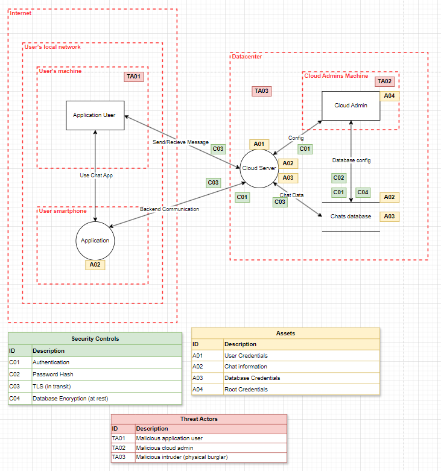

# Lab 2

## Threat Model


**Vragen**
- Zou je op basis van het threat moden "encryption at rest" aanraden?
    - Ja, de gegevens die een cloud admin of intruder kan stelen kunnen heel kwetsbaar zijn.

- Homomorphic encryption aanraden? 
    - Het zou nuttig kunnen zijn maar in mijn model is het probleem vooral bij het onbevoegde toegang tot gevoelige gegevens.

- E2EE en hoe past het in mijn model?
    - E2EE is wanneer berichten worden versleuteld op het moment dat ze door de afzender worden verzonden en pas ontsleuteld door de ontvanger. Zelfs de servers ziet de inhoud niet.
    - Het zou bij mij helpen tegen mensen die gegevens willen stelen, want de gegevens zijn altijd versleuteld.


## Homomorphic encryption
Script in repo

## Shamir Secrect Sharing
Ik heb de sslib libray gebruikt in python dit ging zeer vlot. 
Het enigste dat mij in de war bracht was de lector die sprak over een cipher text. Ik zal dit zeker navragen in de les!

Share 1: '1-mN1BhzYKdrBA6Ix3SARc1xHlkIgQHimj' <br>
Link naar paste.ee met share 2 erop: https://paste.ee/p/m9E3K

## Post Quantum
Ik heb de zin geencrypteer met Kyber dit is een post quantum algoritme dat niet te moeilijk isz. Ik heb een script ```kyber_encrypt.py``` om de zin te encrypteren. 

Mijn werkwijze:

- Key Generation: Als eerste stap genereer ik een paar sleutels private key en public key.

- Encryption: Ik een box object aan met behulp van de private en public key. Met dit box object encrypt ik een zin.

- Decryption: Om de versleutelde zin weer te kunnen lezen, heb ik de private key nodig die gebruikt is voor de encryptie. We plaatsen de private en de public key in een decrypt box. Dit kan gedaan worden door de hex-versie van de sleutels te krijgen en deze om te zetten naar key objecten. als dat is gebeurd kan ik het box object gebruiken om de zin te decrypten.

